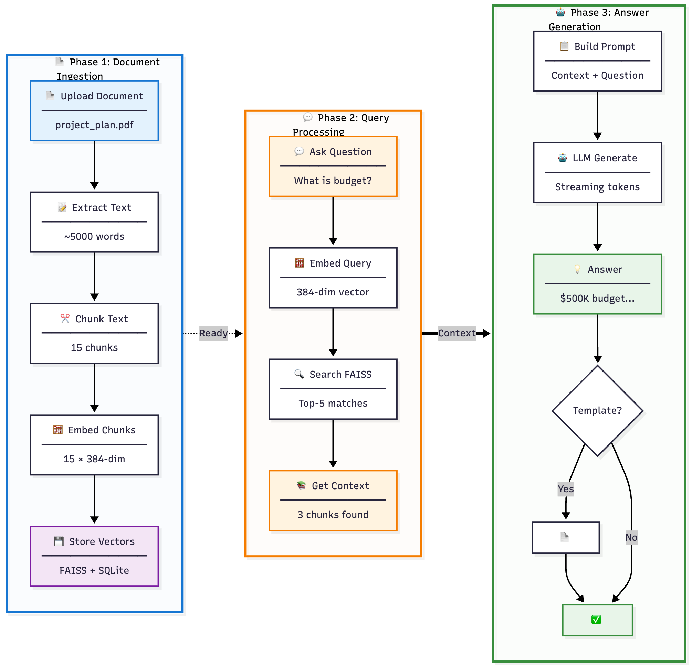

# Technical Explanation of the Offline AI Assistant

This document explains the technical design of the **Offline AI Desktop Assistant**, covering the purpose of each component, the tools used, and how they interact.

## Flow Diagram



---
## Project Structure

```
offline_ai_assistant/          # Project root
├── offline_ai_assistant/      # Main application package
│   ├── __init__.py           # Package initialization
│   ├── config.py             # Configuration and settings
│   ├── extractor.py          # PDF/DOCX text extraction
│   ├── chunker.py            # Token-based text chunking
│   ├── embedder.py           # Sentence-transformers embeddings
│   ├── vectorstore.py        # FAISS + SQLite vector storage
│   ├── llm.py                # llama-cpp-python LLM wrapper
│   ├── rag.py                # RAG pipeline orchestration
│   ├── model_manager.py      # Model download and management
│   └── app_ui.py             # PySide6 desktop GUI
├── docs/                     # Documentation files
│   ├── CHUNKING_EXPLAINED.md  # Detailed chunking guide
│   ├── CONFIGURATION.md      # Configuration guide
│   └── config.example.json   # Example configuration
├── requirements.txt          # Python dependencies
├── README.md                 # Comprehensive documentation
└── TECHNICAL_DESIGN.md       # This technical guide

# User Data Storage (separate from project)
~/.config/ai-offline-assistant/
├── db/                       # FAISS index + SQLite metadata
│   ├── faiss_index          # Vector embeddings index
│   └── metadata.db          # Document and chunk metadata
├── docs/                     # Uploaded documents (copied here)
├── models/                   # AI models and embeddings cache
│   ├── sentence-transformers/  # Embedding model cache
│   └── *.gguf               # LLM model files
├── logs/                     # Application logs
│   └── app.log              # Main log file
└── config.json              # User configuration settings
```


---

## 1. Desktop Application Framework
- **Tool:** `PySide6` (Qt for Python)  
- **Purpose:** Provides a **cross-platform GUI** (Windows, macOS, Linux).  
- **How it works:**  
  - Renders windows, menus, buttons, and text fields natively.  
  - Connects user actions (e.g., "Upload PDF") to backend functions via Qt's **signal-slot mechanism**.  
- **Why chosen:**  
  - Native look-and-feel.  
  - Lighter and faster than Electron.  
  - Cross-platform compatibility.

---

## 2. Document Parsing
- **Tools:**  
  - `pymupdf` → PDF parsing.  
  - `python-docx` → DOCX parsing.  
- **Purpose:** Convert binary files → clean text.  
- **How it works:**  
  - `pymupdf` extracts text page by page from PDFs.  
  - `python-docx` reads Office Open XML and extracts structured text.  
- **Why chosen:**  
  - Lightweight, accurate, and works offline.

---

## 3. Text Chunking
- **Tool:** `tiktoken`  
- **Purpose:** Break large documents into **manageable chunks**.  
- **How it works:**  
  - Splits text based on **token count** (not characters).  
  - Adds **overlap** (e.g., 50 tokens) to preserve context.  
- **Why chosen:**  
  - Keeps chunks within the LLM context window.  
  - Improves search + retrieval accuracy.

---

## 4. Embeddings
- **Tool:** `sentence-transformers` (`all-MiniLM-L6-v2`)  
- **Purpose:** Convert text → **vector embeddings** (high-dimensional arrays).  
- **How it works:**  
  - Transformer model maps semantically similar sentences close in vector space.  
  - Example: “Company revenue rose” ≈ “Business income increased”.  
- **Why chosen:**  
  - Runs offline.  
  - Fast and lightweight (384 dimensions).  
  - Strong accuracy vs. model size.

---

## 5. Vector Database
- **Tools:**  
  - `FAISS` → fast similarity search.  
  - `SQLite` → metadata storage.  
- **Purpose:** Store and search embeddings efficiently.  
- **How it works:**  
  - FAISS indexes vectors for nearest-neighbor search.  
  - SQLite stores metadata (doc name, page, chunk ID).  
- **Why chosen:**  
  - FAISS = scalable + fast.  
  - SQLite = lightweight, file-based, no server needed.

---

## 6. Local LLM
- **Tool:** `llama-cpp-python` (bindings for `llama.cpp`)  
- **Purpose:** Run a **local large language model** (LLM).  
- **How it works:**  
  - Loads quantized GGUF model (e.g., LLaMA 3, Mistral).  
  - Runs inference on CPU/GPU → predicts tokens sequentially.  
  - Supports streaming responses to the UI.  
- **Why chosen:**  
  - 100% offline.  
  - Works on consumer hardware with quantization.  
  - Easy Python integration.

---

## 7. Retrieval-Augmented Generation (RAG)
- **Purpose:** Ground LLM answers in **user documents**.  
- **How it works:**  
  1. User query → embedded.  
  2. FAISS retrieves top-k relevant chunks.  
  3. Construct RAG prompt:  
     ```
     Question: <user query>
     Relevant context: <retrieved chunks>
     Answer based only on the context above.
     ```
  4. LLM generates a grounded answer with citations.  
- **Why chosen:**  
  - Reduces hallucinations.  
  - Ensures answers come from user data.

---

## 8. Drafting Templates
- **Purpose:** Provide **structured output** for professional use cases.  
- **How it works:**  
  - Predefined prompts (e.g., project plan, summary, risk report).  
  - Inserts user documents + context.  
  - Passes prompt to LLM → generates formatted content.  
- **Why chosen:**  
  - Ensures consistent, reusable outputs.  
  - Saves time for client-facing reports.

---

## 9. Data Privacy
- **Design choices:**  
  - No external API calls (no OpenAI, no cloud).  
  - All models, embeddings, and docs stored locally in `~/.config/ai-offline-assistant/`.  
  - SQLite database can be encrypted (e.g., with `sqlcipher`).  
  - User data separated from application code for security and portability.  
- **Why chosen:**  
  - Meets compliance and client confidentiality requirements.  
  - Works in **air-gapped** environments.  
  - Follows standard user data storage conventions.

---

## 10. Configuration Management
- **Tool:** JSON-based configuration with automatic persistence  
- **Purpose:** Store user settings and preferences persistently.  
- **How it works:**  
  - Settings stored in `~/.config/ai-offline-assistant/config.json`.  
  - Automatically loaded on application startup.  
  - Changes saved immediately when user modifies settings.  
  - Fallback to defaults if config file doesn't exist.  
- **Why chosen:**  
  - User-friendly: settings persist across sessions.  
  - Standard location: follows XDG Base Directory specification.  
  - Easy to backup and migrate user preferences.

---

## Workflow Overview
1. User uploads a PDF/DOCX (copied to `~/.config/ai-offline-assistant/docs/`).  
2. Text extracted → chunked → embedded.  
3. Embeddings stored in FAISS + SQLite (in `~/.config/ai-offline-assistant/db/`).  
4. User submits query.  
5. Query embedded → FAISS retrieves top-k chunks.  
6. RAG pipeline builds prompt with query + context.  
7. LLM generates grounded response.  
8. Response + citations displayed in GUI.  
9. Optional: drafting templates generate structured reports.  

---


## Summary of Tools

| Tool                  | Purpose                  | Why Chosen                     |
|-----------------------|--------------------------|--------------------------------|
| **PySide6**           | GUI                      | Native, cross-platform         |
| **pymupdf, python-docx** | Document parsing      | Reliable, offline              |
| **tiktoken**          | Text chunking            | Token-aware, LLM-friendly      |
| **sentence-transformers** | Embeddings           | Fast, lightweight, offline     |
| **FAISS + SQLite**    | Vector DB + metadata     | Scalable, lightweight, local   |
| **llama-cpp-python**  | Local LLM runtime        | Offline, efficient             |
| **RAG pipeline**      | Grounded AI responses    | Prevents hallucinations        |
| **JSON config**       | Settings persistence     | User-friendly, standard location |

---